

# 🏗️ ToolkitBIM Quantifier (BIM Quantifier Pro)

### Professional BIM Quantity Takeoff & Cost Estimation for Revit
### پلاگین حرفه‌ای متره برآورد و قیمت‌گذاری رویت

[📥 Download Latest](https://github.com/dotnetbim/toolkitbim-quantifier/releases/latest) | 
[💬 Telegram Support](https://t.me/toolkitbim) | 
[💼 LinkedIn](https://linkedin.com/in/mohamad-qahremani-0a581b3b2)

---

## 🇬🇧 English

### 🎯 WHY BIM QUANTIFIER PRO?
In the fast-paced world of construction, time is money. Traditional quantity takeoff methods are time-consuming, error-prone, and difficult to update. 

**ToolkitBIM Quantifier** transforms this process:
- ✅ Complete takeoff in **UNDER 1 MINUTE**
- ✅ **100% ACCURACY** (direct from BIM model)
- ✅ **AUTO-UPDATE** with model changes
- ✅ **PROFESSIONAL PDF reports** with your company logo

### ✨ KEY FEATURES
- 🏗️ **Comprehensive Takeoff:** Walls, Floors, Roofs, Doors, Windows (and more elements in future updates). Extracts Length, Area, Volume, and Openings.
- 💰 **Smart Pricing:** Set prices by element type, apply waste factors automatically, and save pricing templates. Supports multiple currencies.
- 📊 **Visual Dashboard:** Pie charts for cost distribution, bar charts for comparison, and real-time visualization.
- 📄 **Professional PDF Reports:** Includes your company logo, automatic date (Shamsi/Gregorian), color-coded tables, and electronic signature.
- 📊 **CSV/Excel Export:** Standard UTF-8 encoding, fully compatible with accounting software.
- 🌍 **Multi-Language:** Full Persian (RTL + Shamsi Calendar) & English (LTR + Gregorian Calendar).
- 🔍 **Advanced Filters:** Filter by Level, Element Type, or use quick search.

---

## 🇮🇷 فارسی

### 🎯 چرا ToolkitBIM Quantifier؟
در دنیای پرشتاب ساخت‌وساز، زمان برابر با پول است. روش‌های سنتی متره برآورد زمان‌بر، دارای خطای انسانی و به‌روزرسانی آن‌ها دشوار است.

**پلاگین ToolkitBIM Quantifier** این فرآیند را متحول می‌کند:
- ✅ متره کامل در **کمتر از ۱ دقیقه**
- ✅ **دقت ۱۰۰٪** (استخراج مستقیم از مدل BIM)
- ✅ **به‌روزرسانی خودکار** با تغییرات مدل
- ✅ **گزارش‌های PDF حرفه‌ای** همراه با لوگوی شرکت شما

### ✨ قابلیت‌های کلیدی
- 🏗️ **متره جامع:** دیوار، کف، سقف، در و پنجره (و عناصر بیشتر در آپدیت‌های آینده). استخراج طول، مساحت، حجم و بازشوها.
- 💰 **قیمت‌گذاری هوشمند:** تعیین قیمت بر اساس نوع عنصر، اعمال خودکار ضریب ضایعات و ذخیره الگوهای قیمت. پشتیبانی از چندین ارز.
- 📊 **داشبورد بصری:** نمودار دایره‌ای برای توزیع هزینه، نمودار میله‌ای برای مقایسه و تجسم بلادرنگ.
- 📄 **گزارش‌های PDF حرفه‌ای:** شامل لوگوی شرکت، تاریخ خودکار (شمسی/میلادی)، جداول رنگی و امضای الکترونیک.
- 📊 **خروجی CSV/Excel:** انکدینگ استاندارد UTF-8، کاملاً سازگار با نرم‌افزارهای حسابداری.
- 🌍 **چندزبانه:** فارسی کامل (راست‌چین + تقویم شمسی) و انگلیسی (چپ‌چین + تقویم میلادی).
- 🔍 **فیلترهای پیشرفته:** فیلتر بر اساس تراز (Level)، نوع عنصر یا جستجوی سریع.

---

## 📸 Screenshots / تصاویر محیط برنامه و گزارش‌ها

#### 🖥️ Main Interface / محیط اصلی برنامه
| Persian (فارسی) | English |
| :---: | :---: |
| 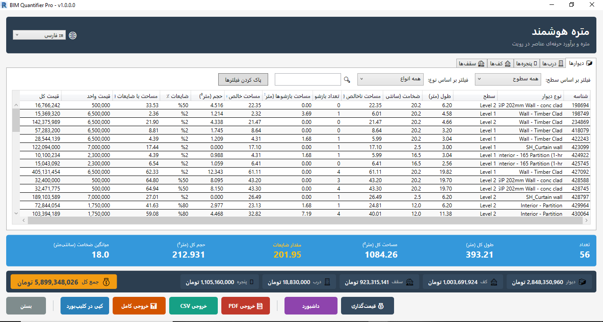 | 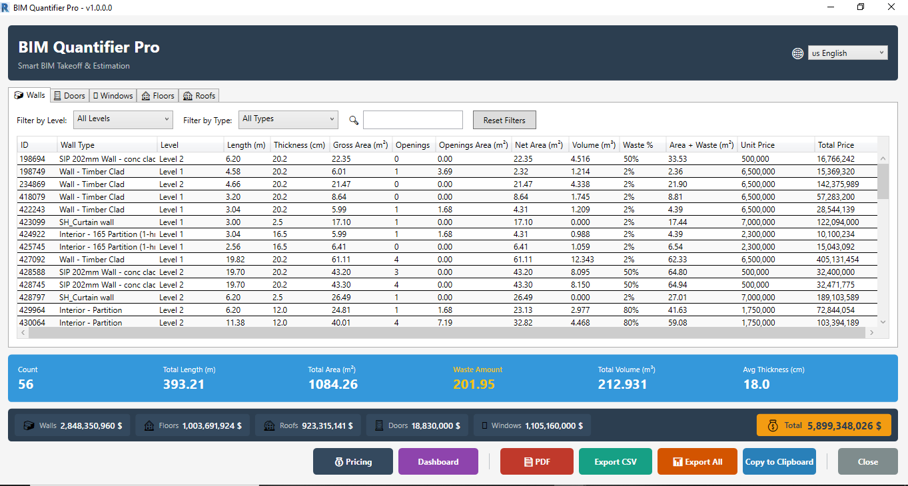 |
| *داشبورد اصلی با متره بلادرنگ و نمودارهای بصری* | *Main dashboard with real-time quantity takeoff and visual charts* |

---

#### 📄 PDF Reports - Persian (گزارش‌های فارسی)
| صفحه ۱: خلاصه (Summary) | صفحه ۲: جداول جزئیات (Detailed Tables) |
| :---: | :---: |
| 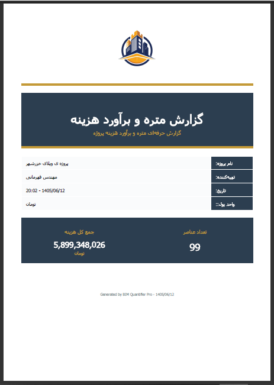 | 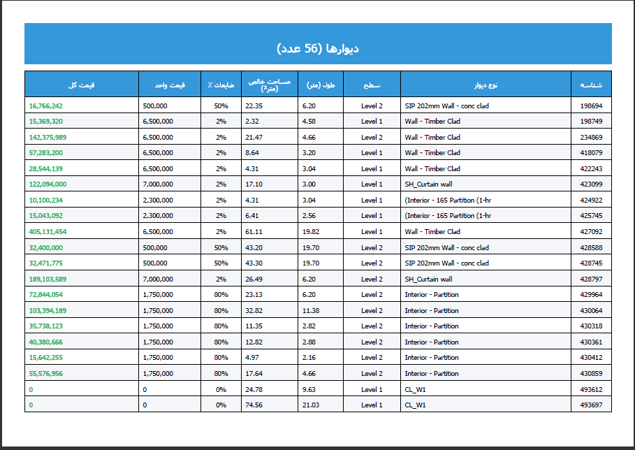 |
| **صفحه ۳: نمودارها (Charts)** | **صفحه ۴: خلاصه نهایی (Final Summary)** |
| 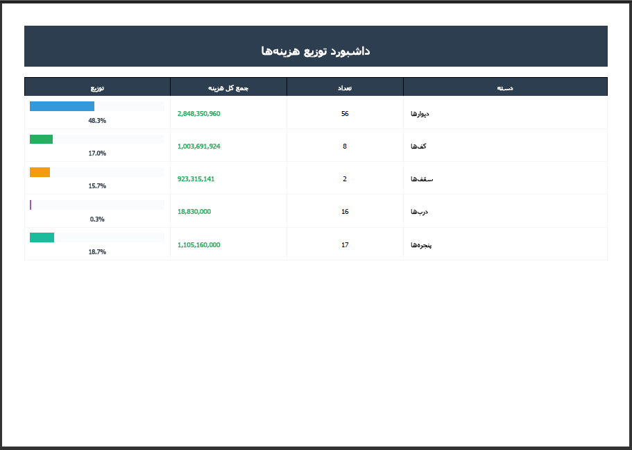 | 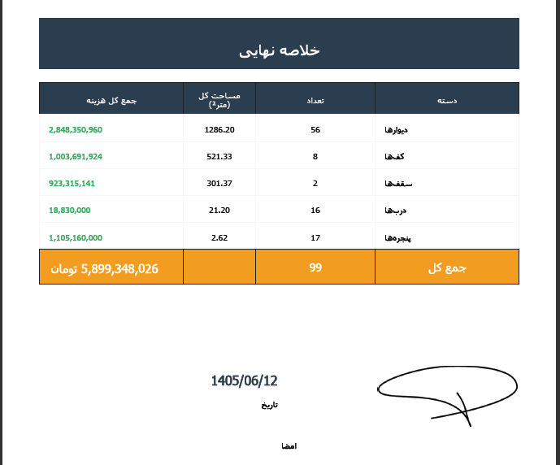 |

---

#### 📄 PDF Reports - English
| Page 1: Summary | Page 2: Detailed Tables |
| :---: | :---: |
| 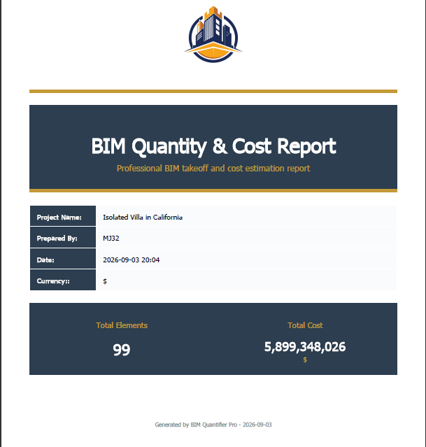 | 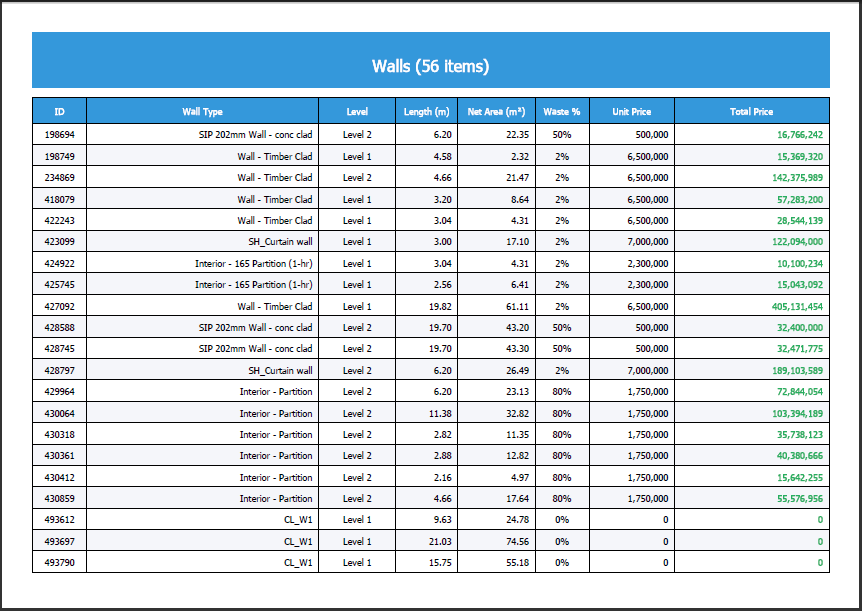 |
| **Page 3: Charts & Analytics** | **Page 4: Final Summary** |
| 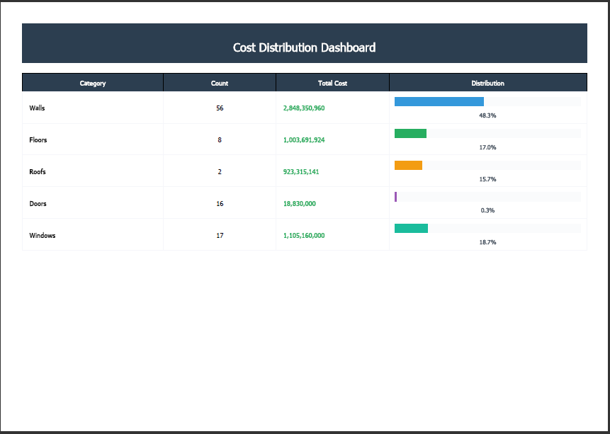 | 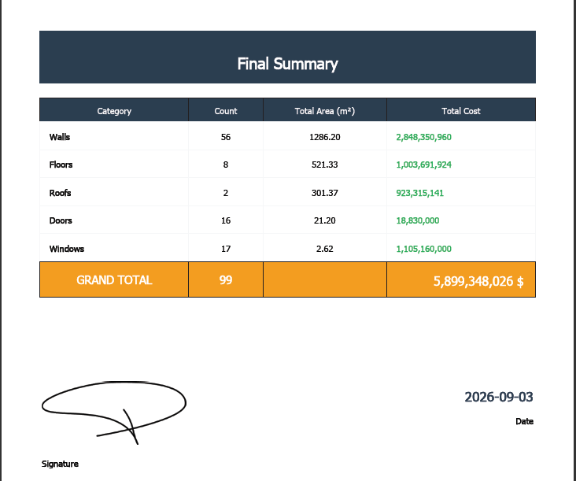 |

---

#### 📊 Excel Export / خروجی اکسل

  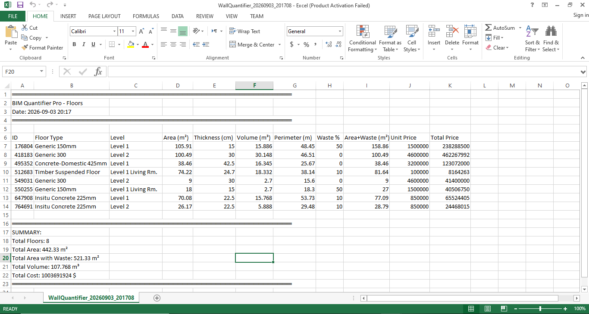
   
  <em>CSV/Excel export compatible with accounting software (خروجی سازگار با نرم‌افزارهای حسابداری)</em>

---

## ⚙️ System Requirements / پیش‌نیازهای سیستم
- **Revit Version / نسخه رویت:** 2022 or later / ۲۰۲۲ و بالاتر
- **Operating System / سیستم‌عامل:** Windows 10 / 11 (64-bit) / ویندوز ۱۰ / ۱۱ (۶۴ بیتی)
- **RAM / رم:** 8 GB minimum (16 GB recommended) / حداقل ۸ گیگابایت (۱۶ پیشنهاد می‌شود)
- **Disk Space / فضای دیسک:** 50 MB / ۵۰ مگابایت
- **Internet / اینترنت:** NOT required (Fully Offline) / نیاز نیست (کاملاً آفلاین)

---

## 🚀 Installation / راهنمای نصب
1. Close Revit completely (Save your work first!) / رویت را کاملاً ببندید (ابتدا کار خود را ذخیره کنید).
2. Run `ToolkitBIM-Quantifier-Setup.exe` (Right-click → "Run as administrator") / فایل نصب را اجرا کنید (کلیک راست → Run as administrator).
3. Follow the installation wizard (Next → Install → Finish) / مراحل نصب را دنبال کنید.
4. Open Revit → Look for the **"BIM Quantifier"** tab in the ribbon / رویت را باز کنید → به دنبال تب **"BIM Quantifier"** در ریبون باشید.

---

## 🔑 License Activation / فعال‌سازی لایسنس
1. Open Revit and click the "BIM Quantifier Pro" button / رویت را باز کرده و روی دکمه "BIM Quantifier Pro" کلیک کنید.
2. The activation dialog appears. Copy your **"Hardware ID"** / پنجره فعال‌سازی باز می‌شود. **"Hardware ID"** خود را کپی کنید.
3. Send the Hardware ID to: 📧 **mj.qahremani@gmail.com** / شناسه سخت‌افزاری را به این ایمیل ارسال کنید.
4. Receive your unique license key and enter it in the dialog / کلید لایسنس اختصاصی خود را دریافت و در پنجره وارد کنید.
5. Start quantifying! 🎉 / از پلاگین استفاده کنید! 🎉

*(Free version available for testing up to 50 elements / نسخه رایگان برای تست تا ۵۰ عنصر در دسترس است).*

---

## 📞 Support & Licensing / پشتیبانی و استعلام قیمت
For pricing inquiries, team licenses, or technical support / برای استعلام قیمت، لایسنس تیمی یا پشتیبانی فنی:
- 📧 **Email:** mj.qahremani@gmail.com
- 💬 **Telegram:** [@toolkitbim](https://t.me/toolkitbim)
- 💼 **LinkedIn:** [Mohamad Javad Ghahremani](https://linkedin.com/in/mohamad-qahremani-0a581b3b2)
- ⏰ **Support Hours:** Sat-Wed (9 AM - 6 PM), Thu (9 AM - 1 PM) / شنبه تا چهارشنبه (۹ تا ۱۸)، پنجشنبه (۹ تا ۱۳)

---

**⭐ If this plugin helps you, please star this repository! ⭐**  
**⭐ اگر این پلاگین به کارتان آمد، لطفاً به مخزن ستاره بدهید! ⭐**

Built with ❤️ in Iran by **Mohamad Javad Ghahremani**  
© 2026 ToolkitBIM (dotnetbim). All rights reserved.

